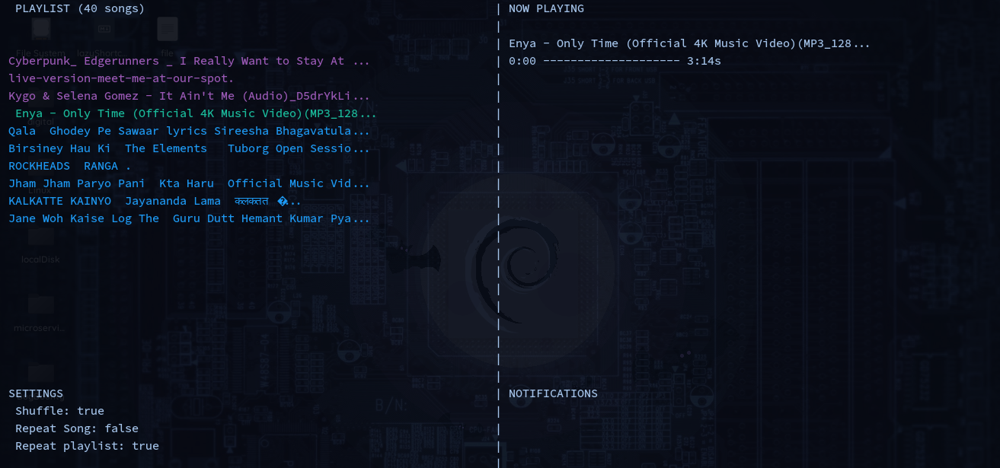

<p align="center">
  
  <p align="center">
    CLI Music Player
  </p>
  <p align="center">
    <a href="https://github.com/axyut/playgo/releases"></a>
    <a href="https://pkg.go.dev/github.com/axyut/playgo#section-readme"></a>
  </p>
</p>

<p align="center" style="margin-top: 30px; margin-bottom: 20px;">
  
</p>

## About Playgo

Play Music in terminal. Written in Go. Relatively feature-packed.

### Built With

- [Go](https://golang.org/)
- [Mp3 Engine](https://github.com/ebitengine/oto/v3)

### Requirements
- [Go](https://golang.org/)
- Windows `files.exe`
- Linux `libs`
- Mac `packs`

## Installation

### Go
```bash
go install github.com/axyut/playgo@latest
```
### Curl
```bash
curl ...install.sh
```

## Development
- `go run . .` or `go build . && sudo cp playgo /usr/local/bin/` and `playgo .`

## Features
- Basic Music Player Features (Shuffle, Repeat, Seek etc)
- Light weight with minimum dependencies
- Visualization (...)

## Themes
- UI with [bubbletea](https://github.com/charmbracelet/bubbletea)
- Raw UI Build

## Usage
```plaintext
## flags
  play files                  - $playgo <file.mp3> <file2.mp3>
  play all music in folder    - $playgo .
  help                        - $playgo -h
  test condition/health       - $playgo -t
## while playing
  q - quit player
  p - Play/Pause

  h - play previous song
  j - seek backward 10s
  k - seek forward 10s
  l - play next song

  w - Increase Volume by 5%
  a - 
  s - Decrease Volume by 5%
  d -

  e - Toogle Repeat Playlist On/Off
  r - Toogle Repeat Song On/Off
  t - Toogle Shuffle On/Off
```
## Configuration
About settings...
A config file will be generated when you first run `playgo`. Depending on your operating system it can be found in one of the following locations:

- macOS: ~/Library/Application\ Support/playgo/config.yml
- Linux: ~/.config/playgo/config.yml
- Windows: C:\Users\me\AppData\Roaming\playgo\config.yml

It will include the following default settings:

```yml
setting:
  general:
    show_icons: true
  player:
    shuffle: true
    repeat_playlist: true
  music:
    repeat_song: false
theme:
  raw: true
```
