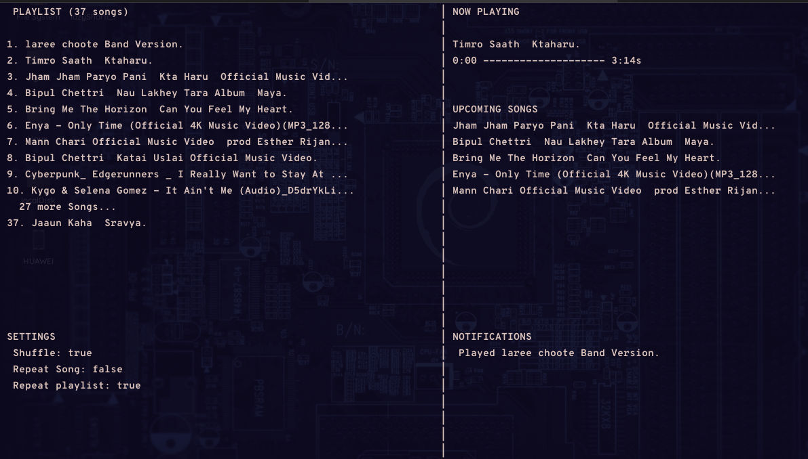

# playGo
A Music Player written in Go.

## Requirements

## Install

## Development
- `go run . .` or
- `go build . && sudo cp playgo /usr/local/bin/`
- `playgo .`

## Usage
```txt
## flags
  play files                  - $playgo <file.mp3> <file2.mp3>
  play all music in folder    - $playgo .
  help                        - $playgo -h
  test condition/health       - $playgo -t
## while playing
  q - quit player
  p - Play/Pause

  h - play previous song
  j - seek backward 10s
  k - seek forward 10s
  l - play next song

  w - Increase Volume by 5%
  a - 
  s - Decrease Volume by 5%
  d -

  e - Toogle Repeat Playlist On/Off
  r - Toogle Repeat Song On/Off
  t - Toogle Shuffle On/Off
```

